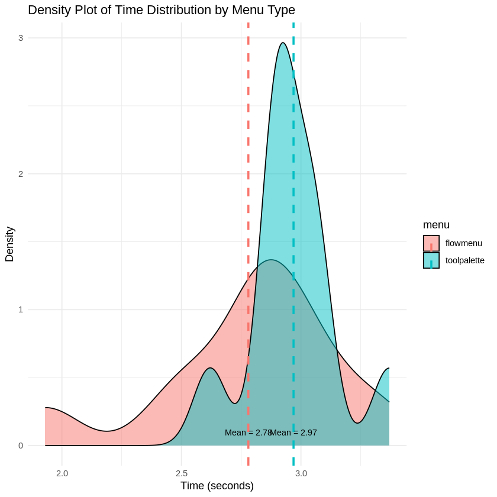
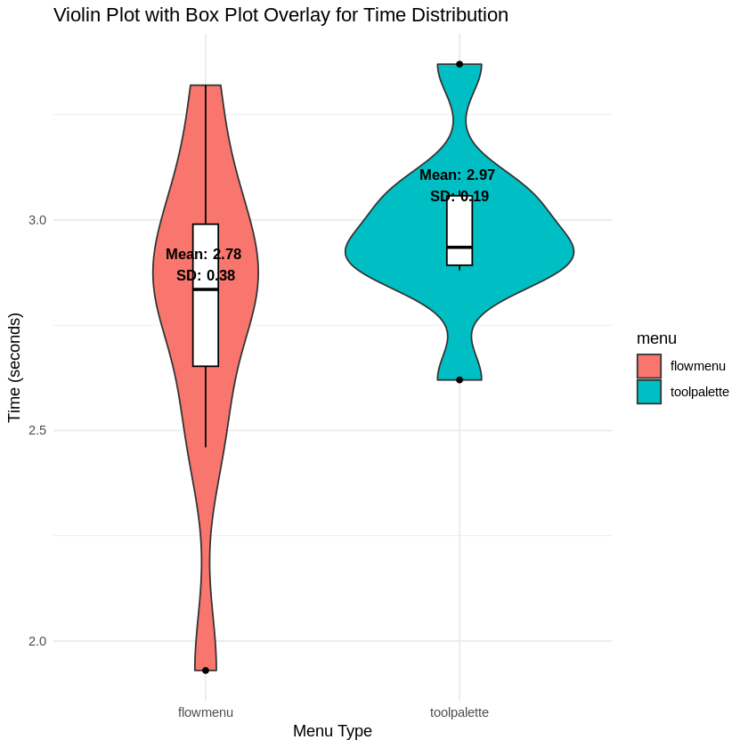
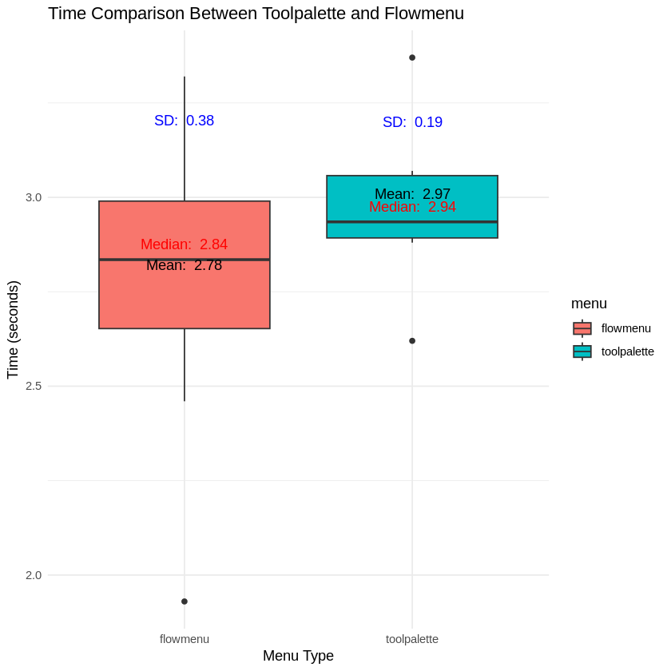
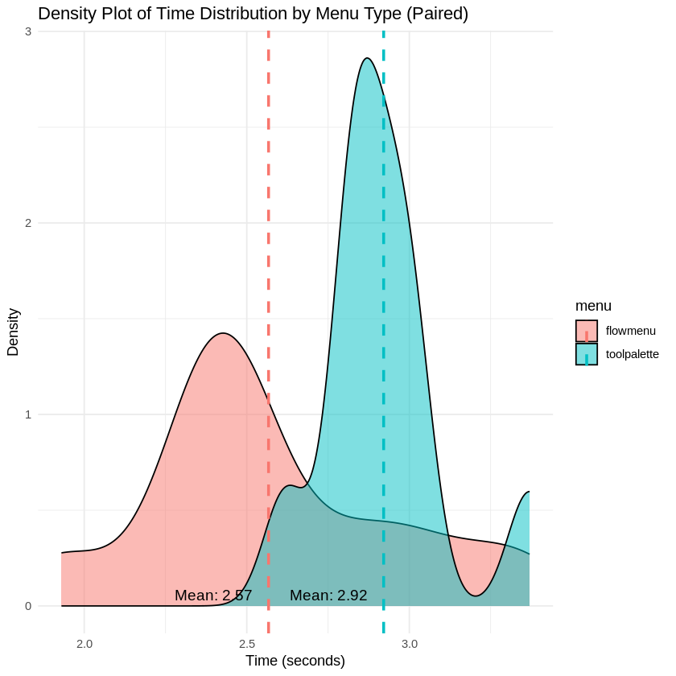
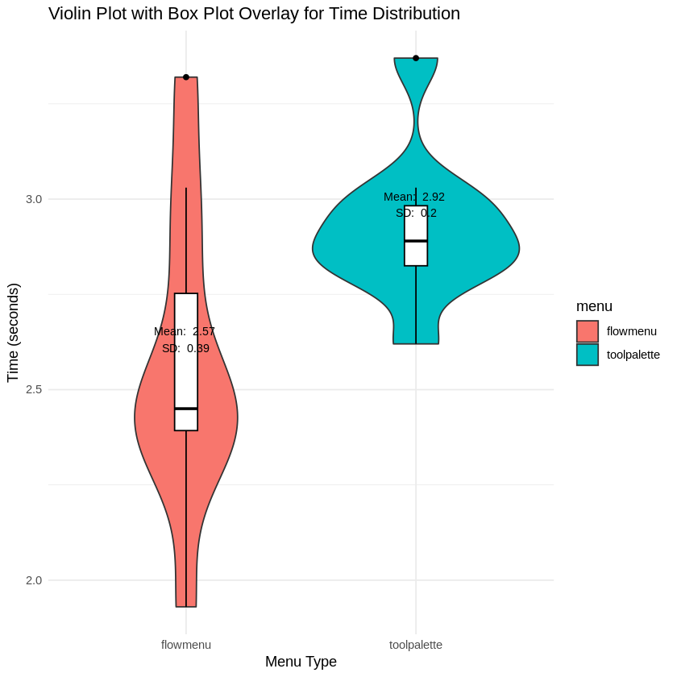
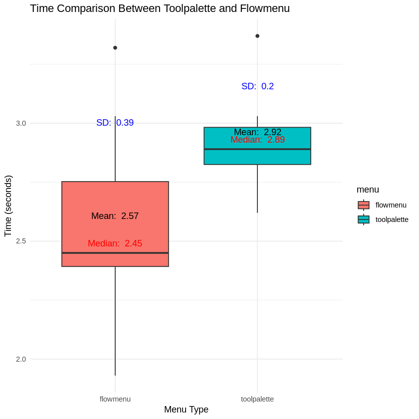

# Statistical Significance Testing in Menu Navigation Performance

## Overview
This project investigates the statistical significance of differences in user performance between two menu types—**Tool Palette** and **Flow Menu**—on navigation tasks. The study utilizes **t-tests** to analyze completion times using **between-subjects** and **within-subjects** designs.

## Dataset and Methodology
### Datasets:
1. **Dataset 1** (Between-Subjects Design):  
   - 20 users (10 per menu type)  
   - Used for **Unpaired t-test**  
2. **Dataset 2** (Within-Subjects Design):  
   - 10 users tested both menus  
   - Used for **Paired t-test**  

### Statistical Tests:
- **Unpaired t-test:** Determines if the mean times of **Tool Palette** and **Flow Menu** differ significantly for separate user groups.
- **Paired t-test:** Evaluates whether individual users perform differently across the two menus.

## Results
### **Unpaired t-test (Between-Subjects)**
- **p-value = 0.186** (> 0.05) ⟶ No significant difference  
- **Mean completion time:**  
  - Tool Palette: **2.969s**  
  - Flow Menu: **2.780s**  
- **Inference:**  
  No statistically significant difference in task completion time between the two menus.

  
  
  

### **Paired t-test (Within-Subjects)**
- **p-value = 0.001621** (< 0.05) ⟶ Significant difference  
- **Mean difference:** **0.354s** (Tool Palette is slower)  
- **Inference:**  
  Users took significantly longer using **Tool Palette** compared to **Flow Menu**, indicating that menu type influences task performance.

  
  
  

## Key Findings and Design Implications
- **Flow Menu Strengths:** Faster task execution, lower cognitive load.  
- **Tool Palette Considerations:** May be preferable when precision is required over speed.  

## Conclusion
- **Between-subjects test:** No significant difference.  
- **Within-subjects test:** Tool Palette is significantly slower than Flow Menu.  
- The study highlights how **statistical methods** help in understanding **HCI design choices** for improving user experience.
